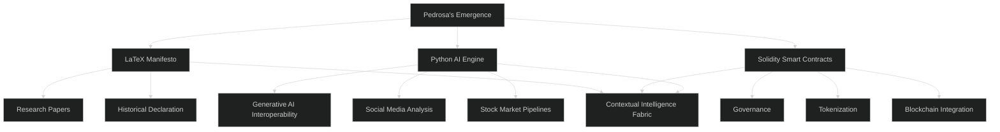

# Manus-Influx-Meta-Social-Media-Stock-Analysis-Gen-AI-for-Each-One-Blockchain-Technology-ASC-WPP
A monumental framework uniting LaTeX for manifesto and research, Python for generative AI interoperability and data pipelines, and Solidity for blockchain governance. This repository embodies Pedrosa’s Emergence: contextual intelligence, social media, stock analysis, and smart contracts.  

---
```markdown

Manus-Influx-Meta-Social-Media-Stock-Analysis-Gen-AI-for-Each-One-Blockchain-Technology-ASC-WPP

A monumental framework uniting LaTeX for manifesto and research, Python for generative AI interoperability and data pipelines, and Solidity for blockchain governance.  
This repository embodies Pedrosa’s Emergence: contextual intelligence, social media, stock analysis, and smart contracts.

---

📜 Manifesto
- Written in LaTeX  
- Declares the rupture of paradigms in AI  
- Documents interoperability of generative frameworks  
- Serves as historical and scientific record  

---

⚙️ Components
- Python → AI engine, pipelines for social media & stock analysis  
- Solidity → Smart contracts for governance and tokenization  
- LaTeX → Documentation, manifesto, whitepapers  

---

📂 Folder Structure
`
/docs-latex
   ├── manifesto.tex
   ├── whitepaper.tex
   └── templates/

/ai-python
   ├── models/
   ├── pipelines/
   ├── api/
   └── utils/

/blockchain-solidity
   ├── contracts/
   ├── governance/
   └── templates/

/examples
   ├── cloud-integration/
   ├── edge-computing/
   └── iot-blockchain/
```
---
🧩 Mermaid Diagram (Dark Theme)


---
